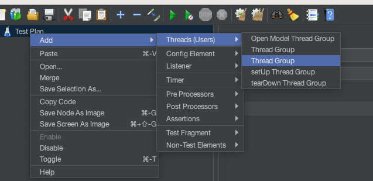
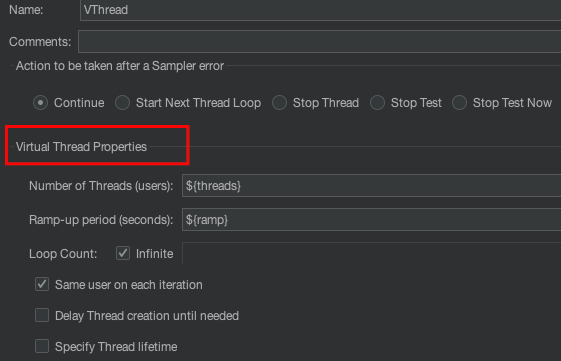
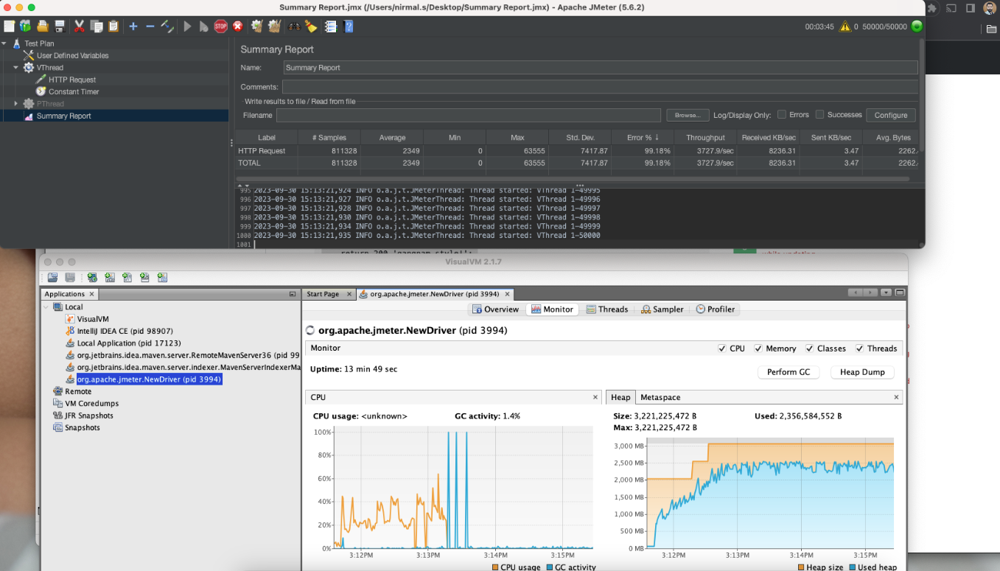

# JMeter Virtual Thread Group Plugin 

This is a quick demonstration of using Java 21 Virtual threads for JMeter, which is a game changer for JMeter. Using virtual threads, we can reduce resource usage dramatically, and a single client would be able to put more load with very low memory usage."

**Java 21 Virtual Threads**: Java Virtual Threads (Project loom), introduced in Java 21, are lightweight threads provided by the Java platform. Unlike traditional threads, virtual threads are managed by the Java Virtual Machine (JVM) and are intended to be more efficient and scalable.

**JMeter**: Apache JMeter is an open-source performance testing tool used for load testing, performance testing, and stress testing of web applications. It is often used to simulate multiple users or clients accessing a web server simultaneously to evaluate its performance.

**Game Changer for JMeter**: This phrase suggests that the introduction of Java 21 Virtual Threads has a significant positive impact on JMeter's capabilities. It implies that this feature greatly improves JMeter's performance and resource management.

**Reducing Resource Usage Dramatically**: Virtual threads are known for their efficiency and reduced overhead compared to traditional threads. By using virtual threads in JMeter, you can expect a substantial reduction in the amount of system resources (such as CPU and memory) required to run performance tests. This means you can simulate more users or clients with less hardware resources.

Single Client Handling More Load: With virtual threads, a single JMeter client (the machine running JMeter) can simulate a higher load on the target server or application. This is because virtual threads are lightweight and consume fewer resources, allowing a single JMeter instance to generate more concurrent requests without overloading the system.

**Low Memory Usage**: Traditional threads can be memory-intensive, especially when you have a large number of concurrent users in a JMeter test. Virtual threads, being lightweight, use significantly less memory. This is particularly beneficial when running JMeter on machines with limited RAM. 


## JDK 21 Dependency

This project requires **JDK 21 or higher**. Before proceeding, make sure you have JDK 21 installed on your system. You can download and install JDK 21 from the official Oracle website or use an OpenJDK distribution.

## Installation

To use this JMeter plugin, follow these steps:

1. Clone the repository to your local machine:
   ```shell
   git clone git@github.com:nirmal-mewada/jmeter-loom.git
   ```

2. Navigate to the project directory:
   ```shell
   cd jmeter-loom
   ```

3. Build the project using Maven:
   ```shell
   mvn clean install
   ```

4. After a successful build, you will find the compiled JAR file in the `target/` directory.

## Using the Plugin in JMeter

1. Copy the generated JAR file from the `target/` directory to the JMeter `lib/ext/` directory.
   ```shell
   cp target/virtual-thread-group-plugin-1.0-SNAPSHOT.jar <path-to-jmeter>/lib/ext/
   ```

2. Start or restart JMeter.

3. You can now use the plugin in your JMeter test plans by adding the appropriate elements to your test plan.

4. Add **Virtual Thread Group** element

5. Configure Threads. You will see title Virtual Thread Properties header for right thread group. 

6. I employed a local Nginx server that responds with a 200 status code. My primary goal was to observe Jmeter's behavior without focusing on errors.

```markdown
-- nginx.conf 
location /test {
    return 200 'OK';
 }
```

7. Final Result.


## Contribution

If you'd like to contribute to this project, please fork the repository and create a pull request. We welcome contributions from the community!

## License

This project is licensed under the MIT License - see the [LICENSE](LICENSE) file for details.

